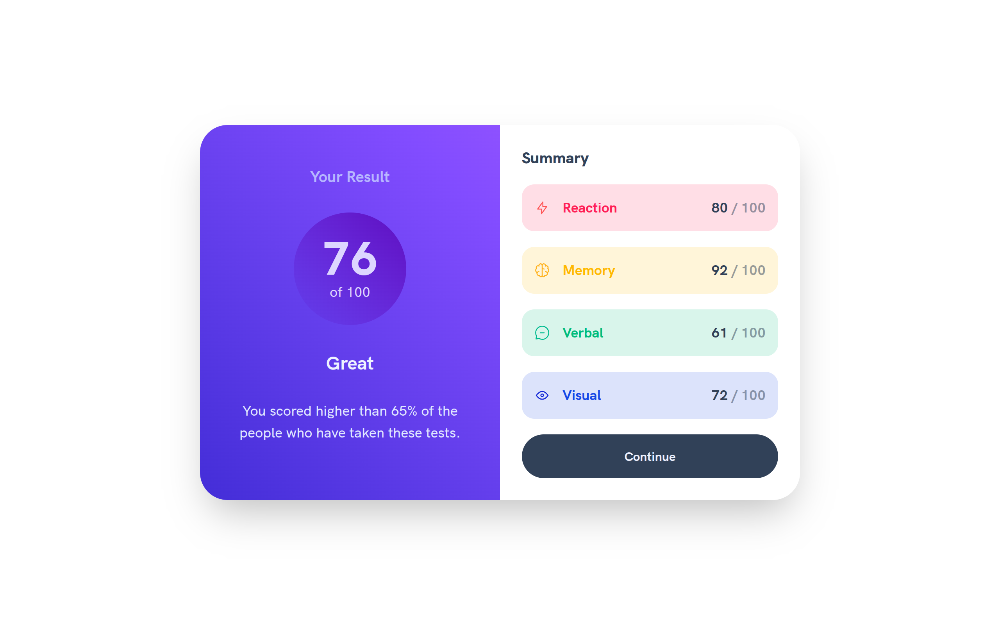

# Frontend Mentor - Results summary component solution

This is a solution to the [Results summary component challenge on Frontend Mentor](https://www.frontendmentor.io/challenges/results-summary-component-CE_K6s0maV). Frontend Mentor challenges help you improve your coding skills by building realistic projects.

## Table of contents

- [Links](#links)
- [Screenshot](#screenshot)
- [Built with](#built-with)
- [Author](#author)

### Links

- [Live Site URL:](https://bytepack-frontendmentor-result-summary.pages.dev/)
- [Solution URL:](https://www.frontendmentor.io/solutions/results-summary-component-Am4hB2R2HM)

### Screenshot

### Built with

- Vue
- Tailwindcss

## Author

- Frontend Mentor - [@bytepack](https://www.frontendmentor.io/profile/bytepack)
